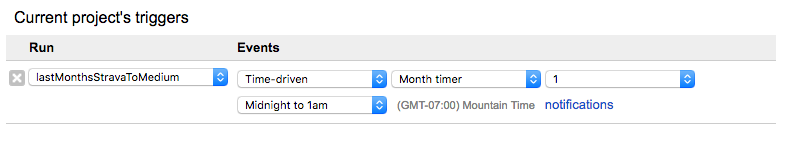

# Last Month's Strava to Medium

Since high school, I've kept a running log that's less about my workouts and more about what I see during the run, half-baked ideas, and such randomness. In the age of GPS-enabled, musical running watches, I chronicle it all on [Strava account](https://www.strava.com/athletes/458890), and this Google Apps Script automagically writes a post of my most popular Strava activities during the last month.

## Usage

### Running the Script

You can simply run `lastMonthsStravaToMedium` and the script will generate a post of the most popular activities that month. However, I suggest setting this project up with a [trigger](https://developers.google.com/apps-script/guides/triggers/) that runs on the first of the month before that days run. My project triggers for this script looks like:

